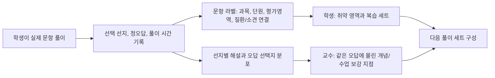

# P:accine 학습 피드백, 학생 분류, 단계형 근거 제시 설계 리서치

작성일: 2026-07-11  
목적: P:accine을 단순 문항 풀이 앱이 아니라, 학생의 풀이 행동을 구조화하고 교수자가 교육 보강에 활용할 수 있는 closed-loop 학습 시스템으로 정리한다.

## 1. Executive Summary

P:accine의 차별점은 "AI가 문제를 만들어준다"가 아니라, 부산대학교 의과대학 내부 문항과 강의/근거 자료를 구조화해 학생 풀이 결과를 다시 학습 경로와 교수 피드백으로 연결하는 데 있다. ChatGPT, Claude, NotebookLM 같은 범용 도구는 문항 단위 풀이 로그, 선택한 오답, 풀이 시간, 과목/단원 라벨, 근거 링크를 한 데이터 구조 안에서 지속적으로 축적하지 않는다. 따라서 P:accine은 생성형 AI보다 "문항-선지-개념-근거-시도 기록"을 안정적으로 저장하고 해석하는 학습 운영체제에 가까워야 한다.

현재 저장소 기준으로 이미 의미 있는 기반은 있다. `qbank_relabeled.json`에는 672개 문항이 있고, 이 중 비어 있지 않은 deterministic `disease_concept_id` mapping은 516개이며 156개는 빈 배열이다. 모든 record는 `assessment_domain`, `major_category`, `topic`, `subtopic`, `source_exam`, `finding_tags` 구조를 가지며 `needs_review=true`이고 실제 Practice 경로와 아직 연결되지 않았다. 현재 concept registry는 598개, finding registry는 196개, distractor bridge는 43개, item evidence pack은 292개다. 또한 40개 attempts만으로는 통계적 결론을 내릴 수 없으므로, 현재 analytics는 "실제 코호트 분석"이 아니라 "기록 구조와 리포트 가능성을 보여주는 계측 장치"로 봐야 한다.

결론적으로 3주 MVP 또는 중간 시연에서 가장 설득력 있는 루프는 다음 하나다.



## 2. Verified Facts, Inferences, Proposals

### Verified Facts

- NBME INSIGHTS는 시험 결과, content area, suggested review area, question detail을 제공하며 점수 변화의 통계적 의미도 안내한다. 참고: [NBME INSIGHTS User Guide](https://www.nbme.org/wp-content/uploads/2026/04/INSIGHTS_User_Guide.pdf)
- NBME CCSSA sample report는 Content EPC와 표준오차/점수 정밀도, 성취도 영역 해석의 한계를 함께 제공한다. 참고: [NBME CCSSA sample report](https://www.nbme.org/sites/default/files/2022-12/CCSSA_Examinee_Performance_Report_2022.pdf)
- NBME CAS Program Guide는 content area report에 최소 20문항, SEM/reliability 산출에 최소 10명, scaled report에 최소 25명 같은 최소 표본 조건을 제시한다. 참고: [NBME CAS Program Guide](https://www.nbme.org/sites/default/files/2023-10/NBME_CAS_Program_Guide.pdf)
- UWorld는 tutor/timed mode, custom test, subject/system/topic별 성과 리포트와 상세 해설을 핵심 기능으로 제공한다. 참고: [UWorld USMLE features](https://medical.uworld.com/usmle/features/)
- AMBOSS는 question difficulty를 사용자 정답률 기반 5-hammer 체계로 설명하고, article 기반 Qbank session과 study/exam mode를 제공한다. 참고: [AMBOSS question difficulty](https://support.amboss.com/hc/en-us/articles/360035679652-Question-difficulty), [AMBOSS Qbank sessions based on Articles](https://support.amboss.com/hc/en-us/articles/360034823632-Qbank-sessions-based-on-Articles)
- Anki FSRS는 복습 간격을 개인 기억 상태에 맞춰 조절하는 알고리즘을 제공한다. 참고: [Anki deck options and FSRS](https://docs.ankiweb.net/deck-options.html)
- 피드백 연구에서는 단순 right/wrong보다 개념 중심, response-oriented feedback이 보존과 전이에 더 유리하다는 결과가 있다. 참고: [Beyond right or wrong](https://pmc.ncbi.nlm.nih.gov/articles/PMC7550480/)
- 피드백은 평균적으로 효과가 있지만, Kluger & DeNisi의 메타분석은 1/3 이상 피드백 개입이 오히려 수행을 악화시킬 수 있음을 보인다. 따라서 순위화/자기비난형 피드백은 피해야 한다. 참고: [Feedback interventions meta-analysis](https://doi.org/10.1037/0033-2909.119.2.254)
- Attempts 로그는 현재 40건, 2명, 9개 시험 세트, 정답 23건이다. 이는 기능 시연용 계측 데이터로는 충분하지만 코호트 추론에는 부족하다.

### Inferences

- P:accine이 강해야 하는 지점은 AI generation 자체보다 "내부 문항을 안전하게 구조화하고, 풀이 행동을 누적해 다음 학습/수업 보강으로 연결하는 것"이다.
- 선지 선택 데이터는 단순 정오답보다 더 강한 학습 신호다. 같은 오답 선지에 학생이 몰리면, 그 선지가 대표하는 오개념이나 감별 실패를 교수자가 확인할 수 있다.
- 하지만 선택 선지를 곧바로 "학생의 생각"으로 단정하면 위험하다. 선지 해설, distractor bridge, item quality, 충분한 응답 수가 함께 있을 때만 misconception으로 해석해야 한다.
- offline relabeled 자산의 concept join coverage는 516/672(76.8%)이며 전부 미승인이다. 또한 신규 문항과 실제 Practice 경로에는 mapping이 없을 수 있으므로 finding-level, topic-level fallback과 승인 gate를 유지해야 한다.

### Proposals

- 학생에게는 raw percentile, leaderboard, "너는 하위권" 같은 표현을 보여주지 않는다.
- 교수에게도 표본 수가 적은 영역은 percentage 대신 "자료 부족"으로 표시한다.
- 오답 피드백은 "선택한 오답이 왜 틀렸는지"보다 "그 선지가 어떤 개념을 의미하며, 왜 이 지문에서는 핵심 원인이 아닌지"로 작성한다.
- 문항 풀이 화면은 제출 전에는 stem/choices/media만 보여주고, 제출 후에 key info, 선지별 해설, learning point, evidence jump를 단계적으로 연다.

## 3. Current P:accine Asset Map

| Asset | Current state | Product meaning |
|---|---:|---|
| `qbank_relabeled.json` | 672 items | 문항별 과목/단원/평가영역/소견 라벨의 중심 테이블 |
| disease concept join | 516/672 deterministic mapping, 156 empty, all `needs_review=true` | offline pilot 후보. Practice 연결·학생 공개 승인과는 별개 |
| `concept_registry.json` | 598 concepts, all `needs_review=true` | 개념 DB 초안. 의료 검수 전제 필요 |
| Harrison evidence | 531/598 concepts | 교과서 근거 연결 후보 |
| concept edges | 538/598 concepts | graph/선후관계/연결 복습 후보 |
| `finding_registry.json` | 196 findings | 질환 미연결 문항의 finding-level fallback |
| `distractor_bridges.json` | 43 bridges | 오답 선지 -> 오개념/감별 실패 연결 후보 |
| `item_evidence_packs.json` | 292 packs | 문항별 근거 제시 및 citation gate 후보 |
| `attempts.jsonl` | 40 attempts | 시연용 풀이 로그. 통계 추론에는 부족 |
| `api_server.py` analytics | weakness, faculty, distractor endpoints 존재 | student/faculty loop 구현 기반 |
| `frontend/app.js` | bookmark, heatmap, distractor, completion report UI 존재 | 학생/교수 화면으로 확장 가능 |

현재 `qbank_relabeled.json` 기준 offline mapping은 **516/672 = 76.8%**다. 672/672라는 과거 문서 수치는 빈 `disease_concept_id=[]`도 필드 존재로 센 오류다. 모두 미승인이며, 실제 Practice Ontology 연결률과 혼용하면 안 된다.

## 4. Benchmark Lessons

### NBME

NBME식 리포트의 핵심은 "점수와 불확실성의 동시 제시"다. P:accine이 NBME를 참고할 때는 학생을 ranking하는 것이 아니라, content area별 신뢰 가능한 feedback을 제공하는 방식을 가져와야 한다. 특히 content area별 report에 충분한 문항 수가 필요하다는 원칙은 P:accine의 analytics gate에 중요하다.

적용:

- attempts가 5 미만인 문항/영역은 percentage를 숨긴다.
- 5-19건은 descriptive signal로만 표시한다.
- 20건 이상에서만 학생/교수 화면에 안정적인 영역 피드백으로 표시한다.
- 25명 이상이 되기 전까지 코호트 평균을 high-stakes 지표처럼 쓰지 않는다.

### UWorld

UWorld는 학습자가 직접 custom test를 만들고, tutor/timed mode를 선택하며, 해설을 통해 개념을 즉시 회수하게 한다. P:accine은 이를 그대로 복제하기보다, 부산의대 기출/과정시험 문항을 라벨 기반으로 조합하는 set builder에 집중해야 한다.

적용:

- 전체 시험지 풀이
- 틀린 문항만
- 북마크 문항만
- 아직 안 푼 문항만
- 특정 과목/단원/질환/소견 문항만
- fast-wrong, slow-wrong 문항만

### AMBOSS

AMBOSS의 강점은 article과 Qbank가 연결되어 있고, 난이도를 실제 사용자 정답률로 정의한다는 점이다. P:accine은 내부 강의록/기출/교과서 근거와 문항을 연결해 "학교 맥락형 AMBOSS"처럼 동작할 수 있다.

적용:

- 질환/소견/검사별 문항 묶음
- 제출 후 핵심 정보와 관련 개념 노트 제공
- difficulty는 초기에 모델 추정치가 아니라 실제 정답률 기반으로 계산
- evidence link는 decorative citation이 아니라 실제 열람 가능한 링크로 관리

### Anki, Osmosis, Lecturio, Sketchy

Anki/FSRS는 장기 기억 스케줄링에 강하고, Osmosis/Lecturio/Sketchy는 영상/시각자료/학습계획에 강하다. P:accine이 3주 MVP에서 이를 모두 구현할 필요는 없지만, 이후 복습 layer에는 다음 원칙이 유효하다.

- 틀린 문항의 핵심 개념을 cloze 카드 후보로 변환
- 문항을 그대로 카드화하지 말고, 자연스러운 개념 문장에서 핵심 단어만 cloze 처리
- 복습 우선순위는 정답률뿐 아니라 "최근 오답, 반복 오답, 빠른 오답, 오래 고민한 오답"을 함께 사용

## 5. Student Stratification Without Harmful Ranking

학생 분류는 "누가 잘하고 못하는가"를 보여주는 것이 아니라, "어떤 학습 행동을 다음에 제안할 것인가"를 결정하기 위한 내부 상태 추정이어야 한다.

### Recommended Student Profile Axes

| Axis | Signal | User-facing wording |
|---|---|---|
| Coverage | unseen / attempted / reviewed | 아직 안 푼 영역, 최근 본 영역 |
| Accuracy | correct rate with minimum counts | 안정적/보강 필요 |
| Speed | normalized time per item | 빠르게 놓친 문항, 오래 고민한 문항 |
| Concept | disease/finding/topic join | 취약 개념 후보 |
| Distractor | selected wrong option | 자주 선택한 헷갈림 포인트 |
| Retention | repeat attempt outcome | 다시 틀린 개념 |
| Confidence (P1) | self-rated confidence | 확신했지만 틀린 문항 |

### Safe Profile Labels

추천 표현:

- "빠르게 놓친 개념"
- "오래 고민한 개념"
- "반복 보강 필요"
- "근거 확인 필요"
- "문항 수 부족"

피해야 할 표현:

- "하위권"
- "위험 학생"
- "부진 학생"
- "같은 학번 대비 낮음"
- "이해 못함"

### Minimum Data Rules

다음 기준은 P:accine 내부 제안 기준이며, 검증된 표준이 아니다.

- 문항 attempts < 5: 정답률 대신 "자료 부족"
- 문항 attempts 5-19: descriptive rate와 넓은 불확실성 표시
- 문항 attempts >= 20: pilot descriptive metric으로 사용 가능
- 개념 취약 신호: 최소 3개 이상 서로 다른 문항에서 5회 이상 응답
- persistent weakness: 7일 이상 간격의 두 세션에서 반복 신호

## 6. From Selected Distractors to Actionable Feedback

선택 선지 데이터의 가장 큰 가치는 "같은 오답에 몰리는 패턴"이다. 예를 들어 정답률만 보면 40%인 문항이지만, 오답자의 70%가 같은 선지를 골랐다면 교수자는 해당 오답 선지가 대표하는 감별 실패를 수업에서 보강할 수 있다.

### Distractor Interpretation Gate

오답 선지를 misconception으로 해석하려면 다음 조건을 통과해야 한다.

1. 문항 정답과 선지 파싱이 검증되어 있다.
2. 해당 선지의 교육용 해설이 존재한다.
3. `distractor_bridges` 또는 선지별 concept mapping이 존재한다.
4. 문항 품질 검사에서 severe issue가 없다.
5. 충분한 응답 수가 있다.

조건을 만족하지 않으면 "misconception"이라고 쓰지 말고 "선택지 분포" 또는 "검토 필요 오답 패턴"으로 표시한다.

### Professor View

교수 화면에서 가장 설득력 있는 표는 다음이다.

| Item | Correct rate | Most selected wrong choice | Wrong-choice explanation | Teaching action |
|---|---:|---|---|---|
| Q27 | 38% | 3번 | 병태생리 A와 B를 혼동 | 관련 개념 보강 문항 생성 |

이 표는 기존 범용 AI가 만들기 어렵다. 왜냐하면 실제 학생이 어떤 오답을 선택했는지와 교수 수업자료/내부 기출 라벨을 동시에 알아야 하기 때문이다.

## 7. Progressive Material Layering

문항 풀이 중 모든 근거와 해설을 처음부터 보여주면 학습 효과가 떨어지고, 답이 노출된다. 따라서 layer를 분리해야 한다.

### Before Submission

- 문항 지문
- 선택지
- 제시자료 이미지/표
- 필요 시 메모, 북마크

숨겨야 할 것:

- 과목/파트/질환 라벨
- key info
- 출제 포인트
- evidence link
- 정답률
- 해설

### Immediately After Submission

- 정오답 표시
- 핵심 단서 하이라이트
- core explanation
- 선택한 선지 설명
- 정답 선지 설명

### Deeper Review

- 전체 선지별 해설
- key learning points
- related concepts
- Anki card 후보
- evidence links
- Harrison/MSD/공식 guideline jump

### Evidence Layering

Evidence는 다음 순서로 보여준다.

1. 앱 내부 요약: 학생이 바로 이해할 수 있는 3-5문장
2. 교과서/가이드라인 근거: Harrison, Williams, Nelson, guideline 등
3. 공개 자료: MSD Manual, CDC, WHO, NICE, KDIGO, ACG 등
4. 논문/저널: PubMed/NEJM 등은 필요한 경우에만

Citation은 신뢰를 높이지만, citation 자체가 틀리면 오히려 위험하다. 따라서 근거 링크는 RAGAS/ALCE식 검증 관점으로 관리하고, link가 약하면 "근거 확인 필요"로 표시해야 한다.

## 8. Proposed Product Roadmap

### P0: 3-Week Demo/Immediate Build

1. Coverage source-of-truth 정리  
   `qbank_relabeled.json`의 516/672 offline draft mapping과 실제 Practice의 승인 mapping coverage를 별도 지표로 관리한다.

2. Mode-based set builder  
   전체/미풀이/오답/북마크/취약 개념/fast-wrong/slow-wrong 세트.

3. 3-axis analytics  
   `major_category` x `assessment_domain` x `disease_or_finding`으로 학생 취약 영역을 표시한다.

4. 제출 후 progressive disclosure  
   제출 전 라벨/해설 숨김, 제출 후 단계별 공개.

5. Distractor distribution report  
   교수 화면에서 문항별 정답률과 오답 선택지 분포 표시.

6. Evidence gate  
   근거가 없는 해설/Anki/citation은 `needs_review` 또는 "근거 확인 필요"로 표시.

7. Item quality gate  
   파싱 오류, 다중정답, 이미지 누락, 해설 미비 문항은 analytics 해석에서 제외.

8. Completion report  
   세트 완료 후 점수, 평균 시간, 틀린 문항, 북마크, 추천 복습 세트 표시.

### P1: Post-Demo

- Confidence capture: 확신했지만 틀린 문항 구분
- Anki export 고도화: 문항 복사형이 아니라 개념문장 cloze
- SRS scheduling: Anki FSRS 원칙을 참고한 앱 내 복습 queue
- Concept map UI: Obsidian graph처럼 직접 연결은 보여주되 mastery 계산은 보수적으로
- Faculty remediation tools: "이 오답 패턴으로 보강 문항 만들기"

### P2: Research/Validation

- Bayesian Knowledge Tracing 또는 interpretable knowledge tracing
- adaptive session generation
- 교수자 dashboard RCT 또는 pilot study
- 코호트 단위 curriculum feedback loop

## 9. Data Model Recommendations

### Core Tables

```text
questions
- question_id
- source_exam
- source_year
- source_period
- question_number
- stem
- choices
- answer_keys
- media_refs
- major_category
- topic
- subtopic
- assessment_domain
- disease_concept_id
- finding_tags
- needs_review
- item_quality

choice_explanations
- question_id
- choice_key
- choice_text
- explanation
- misconception_tag
- evidence_refs
- needs_review

attempts
- attempt_id
- user_id
- question_id
- selected_choices
- is_correct
- time_ms
- mode
- submitted_at
- bookmarked

concepts
- concept_id
- preferred_label
- aliases
- system
- parent_ids
- related_finding_ids
- evidence_refs
- needs_review

evidence_refs
- evidence_id
- source_type
- title
- url_or_local_ref
- citation_status
- access_note
- last_verified_at
```

### Fallback Hierarchy

When `disease_concept_id` is missing:

1. Use `finding_tags`
2. Use `topic/subtopic`
3. Use `assessment_domain`
4. Mark as `concept_mapping_needed`

현재 offline relabeled 672문항 중 516문항만 비어 있지 않은 draft concept mapping을 가지며, 신규 문항과 실제 Practice 문항은 mapping이 없을 수 있다. 따라서 이 fallback은 계속 필요하다.

## 10. UI/UX Recommendations

### Student Practice

- Hide labels before answering.
- Show only question, choices, media, bookmark, timer.
- After answer: show chosen result, then key info, then choice explanations.
- Keep source/evidence in a collapsible "근거 확인" area.
- Avoid developer labels like `complex_clinical_reasoning` or raw `source_exam` tags in the main learning view.

### Student Report

- Show:
  - score
  - average time
  - wrong items
  - bookmarked items
  - weak concepts with enough data
  - next set buttons
- Do not show:
  - raw percentile
  - public ranking
  - high-stakes diagnosis of ability

### Faculty Report

- Show:
  - item correct rate
  - most selected wrong choice
  - linked concept/finding
  - teaching suggestion
  - item quality warning
  - sample size warning
- Allow:
  - create follow-up set
  - export item list
  - mark item for review

## 11. Research Risks and Guardrails

| Risk | Why it matters | Guardrail |
|---|---|---|
| Small sample overinterpretation | 40 attempts cannot support cohort claims | Label as demo/instrumentation |
| Wrong answer key | 교수 시연에서 치명적 | Demo subset manual verification |
| Citation decoration | 링크가 틀려도 신뢰를 올릴 수 있음 | Evidence gate and verified URL |
| Harmful ranking | 피드백이 수행을 악화시킬 수 있음 | No leaderboard by default |
| Graph overclaim | Concept edge가 mastery를 보장하지 않음 | Graph is navigation, not diagnosis |
| Copyright | Internal exams and textbooks need permission | Use approved/synthetic/demo data |
| Medical accuracy | Generated explanations can hallucinate | needs_review, faculty signoff |

## 12. Final Recommendation

P:accine의 다음 개발은 "더 많은 AI 생성"이 아니라 "더 좋은 풀이 로그, 더 안전한 피드백, 더 정확한 근거 연결"에 집중해야 한다. 중간 시연에서 보여줄 핵심은 하나면 충분하다.

> 학생이 실제 문항을 풀면, P:accine이 정오답뿐 아니라 선택한 오답, 풀이 시간, 문항 라벨, 근거 자료를 연결해 학생에게는 다음 복습 세트를, 교수에게는 수업 보강 지점을 제안한다.

이것이 NotebookLM이나 범용 LLM이 아니라 P:accine을 써야 하는 이유다.

## References

- [NBME INSIGHTS User Guide](https://www.nbme.org/wp-content/uploads/2026/04/INSIGHTS_User_Guide.pdf)
- [NBME CCSSA Examinee Performance Report](https://www.nbme.org/sites/default/files/2022-12/CCSSA_Examinee_Performance_Report_2022.pdf)
- [NBME CAS Program Guide](https://www.nbme.org/sites/default/files/2023-10/NBME_CAS_Program_Guide.pdf)
- [NBME Comprehensive Subject Exams](https://www.nbme.org/educators/assess-learn/subject-exams/comprehensive)
- [NBME Item Writing Guide](https://www.nbme.org/sites/default/files/2021-02/NBME_Item%20Writing%20Guide_R_6.pdf)
- [UWorld USMLE Features](https://medical.uworld.com/usmle/features/)
- [AMBOSS Question Difficulty](https://support.amboss.com/hc/en-us/articles/360035679652-Question-difficulty)
- [AMBOSS Qbank Sessions](https://support.amboss.com/hc/en-us/articles/360032477132-Creating-a-Qbank-session)
- [AMBOSS Study Mode and Exam Mode](https://support.amboss.com/hc/en-us/articles/360036038991-Using-Study-Mode-Exam-Mode)
- [AMBOSS Article-Based Qbank Sessions](https://support.amboss.com/hc/en-us/articles/360034823632-Qbank-sessions-based-on-Articles)
- [Anki Deck Options and FSRS](https://docs.ankiweb.net/deck-options.html)
- [Osmosis Study Schedule](https://www.osmosis.org/features/study-schedule)
- [Osmosis Features](https://www.osmosis.org/features/)
- [Lecturio Medical Pricing](https://www.lecturio.com/medical/pricing/)
- [Sketchy](https://www.sketchy.com/)
- [USMLE Step 2 CK Content Outline](https://www.usmle.org/exam-resources/step-2-ck-materials/step-2-ck-content-outline-specifications)
- [Beyond Right or Wrong: Feedback for Multiple-Choice Questions](https://pmc.ncbi.nlm.nih.gov/articles/PMC7550480/)
- [Feedback Interventions Meta-Analysis](https://doi.org/10.1037/0033-2909.119.2.254)
- [Feedback Timing Study](https://pubmed.ncbi.nlm.nih.gov/38017648/)
- [Mastery Learning in Health Professions Education](https://pubmed.ncbi.nlm.nih.gov/23807104/)
- [Learning with Concept Maps Meta-Analysis](https://doi.org/10.3102/00346543076003413)
- [Studying vs Constructing Concept Maps](https://eric.ed.gov/?id=EJ1179084)
- [Interpretable Knowledge Tracing](https://doi.org/10.1609/aaai.v36i11.21560)
- [Bayesian Knowledge Tracing](https://doi.org/10.5281/zenodo.3554629)
- [Learning Analytics Dashboard RCT](https://link.springer.com/article/10.1007/s10734-020-00560-z)
- [Distractor Quality Study](https://pmc.ncbi.nlm.nih.gov/articles/PMC7372664/)
- [Functional Distractors in MCQs](https://pubmed.ncbi.nlm.nih.gov/21106066/)
- [RAGAS](https://arxiv.org/abs/2309.15217)
- [ALCE](https://arxiv.org/abs/2305.14627)
- [Citation Trust and Source Quality](https://ojs.aaai.org/index.php/AAAI/article/view/34550)

---

## 13. v2 델타 (2026-07-13) — 검증 리서치 통합

> 2026-07-13 세션에서 14축(플랫폼4 + 문헌7 + 온톨로지/RAG/AIG 3) 멀티에이전트 리서치를 웹+PubMed 적대검증으로 재수행(108발견·37검증인용). 아래는 §1~12를 **대체하지 않고 보강**하는 델타만 기록. 원본 방향 유지. 전체 합성 원본 = 세션 산출 `synth_report.json`, P0 티켓 = `docs/P0_Feedback_Stratification_Tickets_20260713.md`.

### 13.1 커버리지 수치 불일치 — 재조정 필요 (액션)
§3은 disease_concept_id 조인을 **516/672 = 76.8%(non-empty)** 로 기록. 그러나 현재 `data_private/embedding/coverage_report.md`는 **items with ≥1 concept = 321/672 = 47.8%**. 두 수치는 세는 대상이 다르거나(빈 배열 포함/재빌드) registry 재빌드로 변경된 것. **`scripts/build_concept_registry.py` 재실행 후 단일 수치로 확정할 것.** 그 전까지 설계는 보수적으로 **47.8%를 상한**으로 가정.

### 13.2 새로 검증된 피드백 근거 (효과크기·인용가능)
| 원칙 | 검증 결과 | 출처 |
|---|---|---|
| elaborated > 정답만 > 정오만 | EF d=0.49 > KCR 0.32 > KR 0.05, transfer 최대 | Van der Kleij 2015 RER |
| self/normative 프레이밍 해악 | 피드백 개입 >1/3이 수행 저하 | Kluger & DeNisi 1996 |
| 확신오답 = 최고수익, 1주 내 relapse | hypercorrection persists a week, high-conf errors return | Butler, Fazio & Marsh 2011 |
| 오답 refute 안 하면 거짓지식 심음 | lure intrusion 지속(negative testing effect) | Butler & Roediger 2008 |
| 피드백 timing 무관 | 즉시 vs 블록끝 동등(전이) | Ryan 2023 Med Educ |
| citation은 틀려도 신뢰↑ | ~12k쿼리 RCT, 환각 인용도 신뢰상승 → 검증은 blocking | Li & Aral 2025 |
| 대시보드 단독 성적무효 | actionable arm만 지속↑, action 커플링 필수 | Borrella 2025 RCT |
| 분산인출 최고 리텐션 | med-ed SMD 0.78; 반복시험 vs 재학습 +13pt@6mo | Maye 2026; Larsen 2009 |
| 숙달 STRUCTURE가 효과 담지 | ES 1.29(술기); UI 풍부함 아님 | Cook 2013 |
| 개념맵 "구성">"열람" | g=0.72 vs 0.43, 약한 학생 최대수혜 | Schroeder 2018 |

### 13.3 §5(계층화) 강화
- **속도×정오답은 per-item 정규화 필수**: time_ms → 문항별 코호트 percentile 변환 후 4분면(절대초 임계는 고수를 덤벙으로 오분류, Desender 2022). fast-wrong = 최우선 타깃.
- **NBME SE 게이트 구체화**: "약함"은 (코호트평균 − 학생) > 그 라벨의 SE 일 때만 발화(라벨당 문항 적어 오탐 방지).
- **47.8% 상한의 답 = 선수개념 그래프 전파**: is_a(하드 선수: 자식≤부모 숙달) + differential_of(공선수)를 순서제약으로 직접 문항 없는 ~52% 개념까지 숙달 borrow(해석가능 베이지안, DKT 아님).
- **KST outer-fringe "다음 공부"**: 선수충족 개념집합 = study-next(flat 히트맵보다 mastery-faithful).
- **per-concept 학습곡선 임계**: 정답률 vs 누적시도 곡선이 threshold 넘을 때만 타일 green(Pusic 2015). 1회 정답 green 금지.

### 13.4 §6(오답피드백) 강화
- **distractor→오개념 라우팅 = selected_choices × distractor_bridges 조인**: 공유소견 브리지 선지(schistocyte→TTP↔HUS) 선택 시 그 선지 해설을 *명명된 혼동*으로 전면화 + 자동 재출제. 브리지는 소견에 정의 → **개념 미연결 ~52% 문항에서도 작동**(fallback).
- **비기능 distractor(<5% 선택) 자동플래그** → `item_quality_check.py` 피드 → 생성기 3지선다 타깃(Tarrant 2009 ~48% NFD; 3옵션 ≈ 5옵션 변별력, Sridharan 2025).

### 13.5 §7(자료계층화) 강화
- **finding→disease→Harrison 3단 사다리 = 근거기반 AMBOSS-Library**: `finding_registry`(1층)→573질환(2층)→`evidence.harrison{chapter,page}`+`evidence_jump_poc`(3층). `distractor_bridges`가 1→2 엣지 공급.
- **개념맵 "구성" remediation**: 오답 후 disease 이웃을 엣지 2~3개 숨겨 `cognitive_model` 단서로 재구성(g=0.72). 기존 그래프 재사용.
- **ordered distractor by is_a 거리**: differential 형제=near-miss / 같은부모=중간 / 무관 top_category=근본갭 → 자동 선수개념 라우팅.

### 13.6 §8(근거) 강화 — 검증을 blocking gate로
Li & Aral 2025(citation은 틀려도 신뢰↑) → **`evidence_jump_poc.py`에 RAGAS/ALCE식 NLI entailment 체크**: 각 해설문장이 인용 Harrison 구절에 함의돼야 표시. `evidence_status='verified'`를 **blocking 조건**. 미근거 ~52%(계산/기전/술기)는 **명시적 abstention**(회색/낙관적 링크 금지).

### 13.7 포지셔닝 가드레일 (신규)
문제은행 숙달 = **T1(시험세팅 지식) 성과**. 문헌은 임상역량 전이 미지지(Cook 2011: knowledge 1.20 → patient 0.50). → "시험 마스터리 도구"로만 마케팅/계측. 과정시험 성적상승은 확정 약속 금지(SRS의 in-course 효과 mixed, deck품질·초기습관이 조절자).

### 13.8 인용 금지 (검증실패, down-weight)
미래일자 '2026 가상환자 RCT', Don 2024 g=0.25, UWorld p-rank 정렬기전, AMBOSS 툴팁 세부, AnkiHub 태그 문자열, Briggs 2006/Wind&Gale 2015 출처, Frappa 2026 PMID. 패턴은 유효하나 **숫자 인용 금지**.
